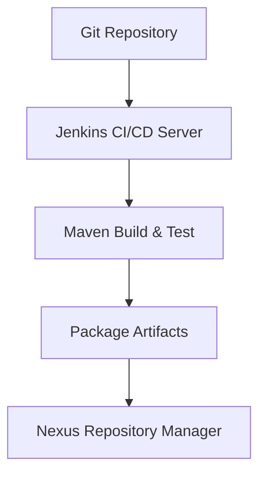

# Nexus Artifact Repository Pipeline

## Overview

This project demonstrates the setup of a **Nexus Repository Manager** using Docker, integrated with a **Jenkins CI/CD pipeline**. The pipeline automates building, testing, packaging, and deploying Maven artifacts to Nexus, providing a complete end-to-end DevOps workflow.

---

## Technology Stack

| Tool             | Version / Notes                   |
| ---------------- | --------------------------------- |
| Operating System | Ubuntu 24.04 (t2.large, 28GB EBS) |
| Jenkins          | LTS, Port 8080                    |
| Docker           | CE latest                         |
| Nexus3           | Docker image: sonatype/nexus3     |
| Maven            | 3.x                               |
| Java             | 17                                |

---

## Setup Overview

### 1. Virtual Machine Preparation

* Launch Ubuntu 24.04 with at least 28GB storage.
* Open required ports for SSH, HTTP/HTTPS, Jenkins (8080), and Nexus (8081).
* Install essential utilities:

```
sudo apt update
sudo apt install curl wget git vim -y
```

### 2. Jenkins Installation

* Install Java 17:

```
sudo apt install openjdk-17-jre-headless -y
```

* Add Jenkins repository and install Jenkins:

```
wget -O /usr/share/keyrings/jenkins-keyring.asc https://pkg.jenkins.io/debian-stable/jenkins.io-2023.key
echo "deb [signed-by=/usr/share/keyrings/jenkins-keyring.asc] https://pkg.jenkins.io/debian-stable binary/" | sudo tee /etc/apt/sources.list.d/jenkins.list
sudo apt update
sudo apt install jenkins -y
sudo systemctl start jenkins
sudo systemctl enable jenkins
```

* Access Jenkins at `http://<public-ip>:8080` and complete setup.

### 3. Docker Installation

* Add Docker repository and install Docker Engine:

```
sudo apt-get install ca-certificates curl -y
sudo mkdir -p /etc/apt/keyrings
curl -fsSL https://download.docker.com/linux/ubuntu/gpg | sudo gpg --dearmor -o /etc/apt/keyrings/docker.gpg
echo "deb [arch=$(dpkg --print-architecture) signed-by=/etc/apt/keyrings/docker.gpg] https://download.docker.com/linux/ubuntu $(lsb_release -cs) stable" | sudo tee /etc/apt/sources.list.d/docker.list
sudo apt update
sudo apt install docker-ce docker-ce-cli containerd.io docker-buildx-plugin docker-compose-plugin -y
sudo usermod -aG docker $USER
sudo systemctl enable docker
sudo systemctl start docker
docker --version
```

### 4. Nexus Setup

* Run Nexus container on Docker:

```
docker run -d --name nexus3 -p 8081:8081 sonatype/nexus3
docker ps
```

* Retrieve admin password from container:

```
docker exec -it nexus3 /bin/bash
cat sonatype-work/nexus3/admin.password
```

* Access Nexus at `http://<public-ip>:8081`, set a new password, and enable anonymous access.

### 5. Jenkins Pipeline Configuration

* Connect Jenkins to the Git repository.
* Define stages in `Jenkinsfile`: Git Checkout → Compile → Test → Package → Deploy Artifacts to Nexus.
* Optional Maven deploy command (run in Jenkins pipeline):

```
mvn deploy -s settings.xml
```

* Verify deployed artifacts in Nexus to confirm pipeline success.

---

## CI/CD Workflow



---

## Purpose of the Project

1. Demonstrate the setup of a **fully automated CI/CD pipeline** using Jenkins and Docker.
2. Showcase the deployment of Maven artifacts to a **Nexus Repository Manager**.
3. Provide a hands-on example of **end-to-end DevOps workflow** for professional portfolios.
4. Practice **integration of multiple DevOps tools** (Git, Jenkins, Maven, Docker, Nexus) in a single project.

---

## Outcomes

1. **Automated Build and Deployment:** Maven projects are automatically compiled, tested, packaged, and deployed to Nexus without manual intervention.
2. **Dockerized Nexus Repository:** Nexus runs in a container, simplifying setup, scaling, and management of artifacts.
3. **Professional Pipeline Workflow:** Jenkins pipeline includes all critical stages (checkout, build, test, package, deploy).
4. **Hands-on DevOps Skills:** Demonstrates practical knowledge of CI/CD, containerization, artifact management, and tool integration.


